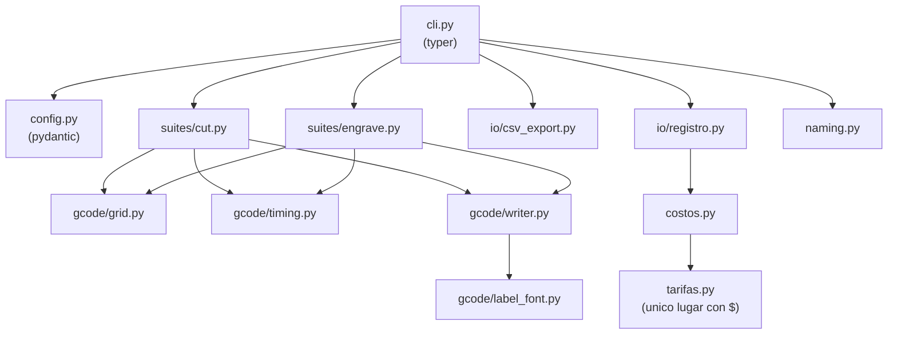

# Pruebas de Corte y Grabado Láser

Proyecto interno para estandarizar, documentar y costear los procesos de corte y grabado láser (CNC 3018 + módulo Laser Tree LT-80W-F45, controlado con LaserGRBL).

## Objetivo

Que ejecutar una prueba sea solo **"abrir un G-code y enviarlo"**, que cada corrida quede documentada y costeada (energía + material + tiempo de máquina), y que el resultado se convierta en **Fichas de Parámetro Estándar** oficiales por material/espesor/operación — reemplazando el ajuste "a ojo" por un proceso repetible y auditable.

El sistema está diseñado para ser **agnóstico al material**: hoy arranca con MDF, pero la estructura (script generador, hoja de registro, fichas) escala a acrílico, contrachapado, cuero, cartón, etc. sin rediseñar nada.

## Estructura del repositorio

```
.
├── src/laser_toolkit/                                     ← paquete Python (la herramienta en sí)
│   ├── config.py                                           ← validacion del YAML de configuracion (pydantic)
│   ├── tarifas.py                                           ← UNICO lugar con valores monetarios (tarifas de negocio)
│   ├── costos.py                                            ← motor de costeo: energia/material/tiempo, siempre separados
│   ├── naming.py                                            ← nomenclatura estandar de archivos
│   ├── cli.py                                                ← comandos `laser-toolkit generate-*/prepare-record/compute-costs`
│   ├── gcode/                                                ← construccion de la grilla, temporizado y emision de G-code
│   ├── suites/                                               ← orquestacion de la suite de corte y de grabado
│   └── io/                                                    ← csv hermano + Hoja de Registro (registro.py)
├── tests/                                                  ← pytest (49 casos, ver `make test`)
├── configs/                                                ← YAML de ejemplo (suites) + plantilla de tarifas
├── docs/
│   ├── Plan Maestro - Estandarizacion Pruebas Laser.md    ← arquitectura completa del sistema
│   ├── sop/                                                 ← protocolos de una página para el taller
│   └── materiales/
│       └── MDF/
│           ├── Analisis Tecnico MDF - LT-80W-F45.md        ← análisis técnico base (parámetros teóricos)
│           └── fichas-parametro/                            ← "recetas" oficiales validadas con datos reales
├── data/
│   ├── registros/                                           ← G-code + csv generados, hojas de registro por corrida
│   └── fotos/                                                ← fotos de cupones de prueba evaluados
├── pyproject.toml / uv.lock                                ← dependencias gestionadas con uv
└── Makefile                                                ← interfaz unica de comandos (`make help`)
```

### Arquitectura interna del paquete `laser_toolkit`



## Uso rápido

```
make install                                    # uv sync -- instala el entorno
make generate-cut CONFIG=configs/mdf_3mm_corte.yaml
make generate-engrave CONFIG=configs/mdf_3mm_grabado.yaml
make prepare-record CSV=data/registros/<corrida>.csv
# ... correr en la maquina, medir, evaluar, completar a mano el _registro.csv ...
cp configs/tarifas.example.yaml configs/tarifas.yaml   # completar con el area financiera
make compute-costs CSV=data/registros/<corrida>_registro.csv TARIFAS=configs/tarifas.yaml
make check                                      # lint + typecheck + test, todo antes de commitear
```

**Flujo de la Hoja de Registro (Fase F2):**

1. `generate-cut`/`generate-engrave` producen el `.gcode` y su `.csv` hermano (una fila por celda: velocidad, potencia, pasadas, `area_material_mm2`, `tiempo_estimado_celda_s` — todo derivado de la configuración, sin medición manual).
2. `prepare-record` agrega las columnas que se completan **a mano** tras correr la corrida real en la máquina: evaluación visual (`corte_pasante`, `calidad_borde_1a5`, `carbonizacion_1a5`, `foto`, `notas`) y las dos mediciones de la corrida completa (`kwh_corrida_medido`, `tiempo_real_corrida_s`).
3. `compute-costs` toma ese registro completado + `configs/tarifas.yaml` y calcula, celda por celda, los **tres componentes de costo por separado** (`costo_energia_celda`, `costo_material_celda`, `costo_tiempo_maquina_celda`) más un `costo_total_celda` de conveniencia — nunca inventa una tarifa: mientras `tarifas.yaml` tenga un valor en `null`, esa columna queda vacía en vez de asumir un número.

`configs/tarifas.yaml` es el **único** archivo del sistema con valores monetarios (tarifa eléctrica, precio de material, tarifa hora-máquina) — lo completa el área financiera/comercial, no el desarrollo. Está en `.gitignore`; solo se versiona `configs/tarifas.example.yaml` como plantilla.

## Convenciones del proyecto Python

- **Entorno y dependencias:** `uv` (`uv sync`, `uv add`, `uv run`) — nunca `pip` ni un venv creado a mano.
- **Linter y formato:** `ruff check` / `ruff format` (`make lint` / `make format`).
- **Tipado:** `pyright` en modo `standard` (`make typecheck`). Todo el código nuevo lleva type hints; si pyright marca un error, se corrige el tipo, no se silencia con `# type: ignore` salvo que quede documentado por qué.
- **Testing:** `pytest` (`make test`), un archivo `tests/test_*.py` por módulo.
- **Antes de cada commit:** `make check` (lint + typecheck + test).

## Estado del proyecto

Ver **[Plan Maestro](docs/Plan%20Maestro%20-%20Estandarizacion%20Pruebas%20Laser.md)** para el detalle de arquitectura, roadmap de fases (F1–F7) y pendientes de negocio (tarifa eléctrica, costo de material, tarifa hora-máquina — hoy configurables como parámetros editables).

| Fase | Entregable | Estado |
|---|---|---|
| F1 | Script generador de G-code | Listo (`laser_toolkit`) |
| F2 | Hoja de Registro + motor de costeo | Listo (`prepare-record`/`compute-costs`, 49 tests) |
| F3 | SOP de una página para el taller | Listo — [`docs/sop/SOP-corrida-de-prueba.md`](docs/sop/SOP-corrida-de-prueba.md) |
| F4 | Corrida piloto MDF 3mm | Pendiente |
| F5 | Calibración de energía (medidor manual/API) | Pendiente |
| F6 | Ficha de Parámetro Estándar v1 — MDF | Pendiente |
| F7 | Extensión a un segundo material | Pendiente |

## Material de referencia

- [Análisis Técnico MDF](docs/materiales/MDF/Analisis%20Tecnico%20MDF%20-%20LT-80W-F45.md): parámetros optomecánicos del módulo LT-80W-F45, comportamiento térmico del MDF, matriz de decisión comercial por línea de producto.
