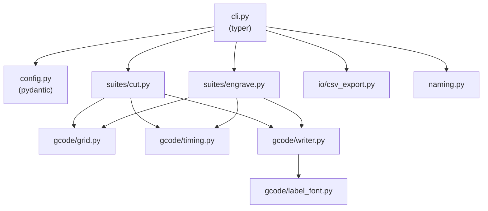

# Pruebas de Corte y Grabado Láser

Proyecto interno para estandarizar, documentar y costear los procesos de corte y grabado láser (CNC 3018 + módulo Laser Tree LT-80W-F45, controlado con LaserGRBL).

## Objetivo

Que ejecutar una prueba sea solo **"abrir un G-code y enviarlo"**, que cada corrida quede documentada y costeada (energía + material + tiempo de máquina), y que el resultado se convierta en **Fichas de Parámetro Estándar** oficiales por material/espesor/operación — reemplazando el ajuste "a ojo" por un proceso repetible y auditable.

El sistema está diseñado para ser **agnóstico al material**: hoy arranca con MDF, pero la estructura (script generador, hoja de registro, fichas) escala a acrílico, contrachapado, cuero, cartón, etc. sin rediseñar nada.

## Estructura del repositorio

```
.
├── src/laser_toolkit/                                     ← paquete Python (la herramienta en sí)
│   ├── config.py                                           ← validacion del YAML de configuracion (pydantic)
│   ├── naming.py                                            ← nomenclatura estandar de archivos
│   ├── cli.py                                                ← comandos `laser-toolkit generate-cut/generate-engrave`
│   ├── gcode/                                                ← construccion de la grilla, temporizado y emision de G-code
│   ├── suites/                                               ← orquestacion de la suite de corte y de grabado
│   └── io/                                                    ← exportacion del csv hermano
├── tests/                                                  ← pytest (27 casos, ver `make test`)
├── configs/                                                ← YAML de ejemplo por material/operacion
├── docs/
│   ├── Plan Maestro - Estandarizacion Pruebas Laser.md    ← arquitectura completa del sistema
│   ├── sop/                                                 ← protocolos de una página para el taller
│   └── materiales/
│       └── MDF/
│           ├── Analisis Tecnico MDF - LT-80W-F45.md        ← análisis técnico base (parámetros teóricos)
│           └── fichas-parametro/                            ← "recetas" oficiales validadas con datos reales
├── data/
│   ├── registros/                                           ← G-code + csv generados, hojas de registro por corrida
│   └── fotos/                                                ← fotos de cupones de prueba evaluados
├── pyproject.toml / uv.lock                                ← dependencias gestionadas con uv
└── Makefile                                                ← interfaz unica de comandos (`make help`)
```

### Arquitectura interna del paquete `laser_toolkit`



## Uso rápido

```
make install                                    # uv sync -- instala el entorno
make generate-cut CONFIG=configs/mdf_3mm_corte.yaml
make generate-engrave CONFIG=configs/mdf_3mm_grabado.yaml
make test                                       # pytest
make lint / make format                         # ruff
```

Cada comando `generate-*` produce, dentro de `data/registros/`, un `.gcode` listo para abrir en LaserGRBL y su `.csv` hermano (una fila por celda de la grilla, con velocidad, potencia, pasadas y tiempo estimado) — ese csv es la base de la futura Hoja de Registro (Fase F2 del Plan Maestro).

## Estado del proyecto

Ver **[Plan Maestro](docs/Plan%20Maestro%20-%20Estandarizacion%20Pruebas%20Laser.md)** para el detalle de arquitectura, roadmap de fases (F1–F7) y pendientes de negocio (tarifa eléctrica, costo de material, tarifa hora-máquina — hoy configurables como parámetros editables).

| Fase | Entregable | Estado |
|---|---|---|
| F1 | Script generador de G-code | Listo (`laser_toolkit`, 27 tests) |
| F2 | Plantilla de Hoja de Registro + motor de costeo | Pendiente |
| F3 | SOP de una página para el taller | Pendiente |
| F4 | Corrida piloto MDF 3mm | Pendiente |
| F5 | Calibración de energía (medidor manual/API) | Pendiente |
| F6 | Ficha de Parámetro Estándar v1 — MDF | Pendiente |
| F7 | Extensión a un segundo material | Pendiente |

## Material de referencia

- [Análisis Técnico MDF](docs/materiales/MDF/Analisis%20Tecnico%20MDF%20-%20LT-80W-F45.md): parámetros optomecánicos del módulo LT-80W-F45, comportamiento térmico del MDF, matriz de decisión comercial por línea de producto.
