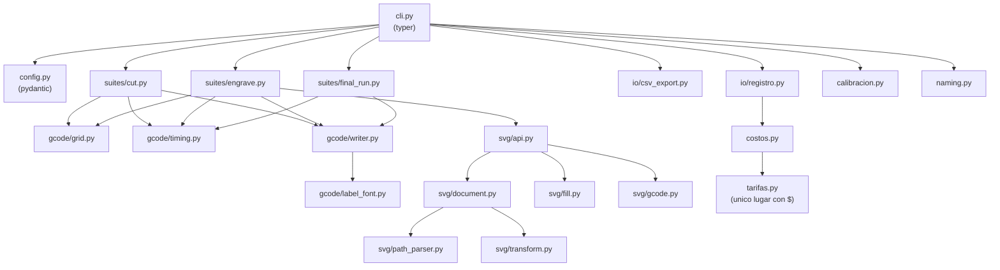

# Pruebas de Corte y Grabado Láser

Proyecto interno para estandarizar, documentar y costear los procesos de corte y grabado láser (CNC 3018 + módulo Laser Tree LT-80W-F45, controlado con LaserGRBL).

## Objetivo

Que ejecutar una prueba sea solo **"abrir un G-code y enviarlo"**, que cada corrida quede documentada y costeada (energía + material + tiempo de máquina), y que el resultado se convierta en **Fichas de Parámetro Estándar** oficiales por material/espesor/operación — reemplazando el ajuste "a ojo" por un proceso repetible y auditable.

El sistema está diseñado para ser **agnóstico al material**: hoy arranca con MDF, pero la estructura (script generador, hoja de registro, fichas) escala a acrílico, contrachapado, cuero, cartón, etc. sin rediseñar nada.

## Estructura del repositorio

Monorepo: `apps/` para lo desplegable, `packages/` para el código compartido. `configs/`, `data/`, `docs/` y `assets/` quedan en la raíz porque los consumen ambos lados (el CLI de escritorio y el frontend web).

```
.
├── apps/
│   └── web/                                                ← frontend Next.js (dashboard, suites, costeo, etc.)
├── packages/
│   └── laser_toolkit/                                      ← paquete Python (la herramienta en sí)
│       ├── pyproject.toml / uv.lock                        ← dependencias gestionadas con uv
│       ├── src/laser_toolkit/
│       │   ├── config.py                                   ← validacion del YAML de configuracion (pydantic)
│       │   ├── tarifas.py                                   ← UNICO lugar con valores monetarios (tarifas de negocio)
│       │   ├── costos.py                                    ← motor de costeo: energia/material/tiempo, siempre separados
│       │   ├── naming.py                                    ← nomenclatura estandar de archivos y grupos de calibracion
│       │   ├── calibracion.py                                ← estadistica entre ejecuciones independientes de Final Run
│       │   ├── cli.py                                        ← comandos `laser-toolkit generate-*/prepare-record/compute-costs`
│       │   ├── gcode/                                        ← construccion de la grilla, temporizado y emision de G-code
│       │   ├── suites/                                       ← orquestacion de suites de barrido y de Final Run
│       │   ├── svg/                                           ← parser SVG propio + conversion a G-code (contorno y relleno)
│       │   └── io/                                            ← csv hermano + Hoja de Registro (registro.py)
│       └── tests/                                          ← pytest (109 casos, ver `make test`)
├── configs/                                                ← YAML de ejemplo (suites) + plantilla de tarifas
├── assets/svg/                                             ← SVG de referencia para pruebas de grabado (logo-empresa.svg)
├── docs/
│   ├── Plan Maestro - Estandarizacion Pruebas Laser.md    ← arquitectura completa del sistema
│   ├── sop/                                                 ← protocolos de una página para el taller
│   └── materiales/
│       └── MDF/
│           ├── Analisis Tecnico MDF - LT-80W-F45.md        ← análisis técnico base (parámetros teóricos)
│           └── fichas-parametro/                            ← "recetas" oficiales validadas con datos reales
├── data/
│   ├── registros/                                           ← G-code + csv generados, hojas de registro por corrida
│   └── fotos/                                                ← fotos de cupones de prueba evaluados
└── Makefile                                                ← interfaz unica de comandos (`make help`), sabe donde vive cada paquete
```

`make` sigue siendo la interfaz única: internamente usa `uv run --project packages/laser_toolkit` para los comandos de generación (mantienen el directorio de trabajo en la raíz del repo, porque `configs/`/`data/` se referencian con rutas relativas a la raíz) y `uv run --directory packages/laser_toolkit` para lint/typecheck/test (que sí asumen estar parados dentro del paquete). No hace falta que lo pienses al usar `make`, solo si tocás el Makefile.

### Arquitectura interna del paquete `laser_toolkit`



## Uso rápido

```
make install                                    # uv sync -- instala el entorno
make generate-cut CONFIG=configs/ejemplo-dev_mdf_3mm_corte.yaml
make generate-engrave CONFIG=configs/ejemplo-dev_mdf_3mm_grabado.yaml
make prepare-record CSV=data/registros/<corrida>.csv
# ... correr en la maquina, medir, evaluar, completar a mano el _registro.csv ...
cp configs/tarifas.example.yaml configs/tarifas.yaml   # completar con el area financiera
make compute-costs CSV=data/registros/<corrida>_registro.csv TARIFAS=configs/tarifas.yaml
make check                                      # lint + typecheck + test, todo antes de commitear
```

**Flujo de la Hoja de Registro (Fase F2):**

1. `generate-cut`/`generate-engrave` producen el `.gcode` y su `.csv` hermano (una fila por celda: velocidad, potencia, pasadas, `area_material_mm2`, `tiempo_estimado_celda_s` — todo derivado de la configuración, sin medición manual).
2. `prepare-record` agrega las columnas que se completan **a mano** tras correr la corrida real en la máquina: evaluación visual (`corte_pasante`, `carbonizacion_1a5`, `foto`, `notas`) y las dos mediciones de la corrida completa (`kwh_corrida_medido`, `tiempo_real_corrida_s`).
3. `compute-costs` toma ese registro completado + `configs/tarifas.yaml` y calcula, celda por celda, los **tres componentes de costo por separado** (`costo_energia_celda`, `costo_material_celda`, `costo_tiempo_maquina_celda`) más un `costo_total_celda` de conveniencia — nunca inventa una tarifa: mientras `tarifas.yaml` tenga un valor en `null`, esa columna queda vacía en vez de asumir un número.

`configs/tarifas.yaml` es el **único** archivo del sistema con valores monetarios (tarifa eléctrica, precio de material, tarifa hora-máquina) — lo completa el área financiera/comercial, no el desarrollo. Está en `.gitignore`; solo se versiona `configs/tarifas.example.yaml` como plantilla.

**Final Run — energía calibrada para producción (Fase F5, sección 8 del Plan Maestro):**

Una suite de barrido reparte el kWh medido entre celdas por *peso de tiempo*, no por potencia real — suficiente para *elegir* la combinación ganadora, pero es una aproximación. Una vez elegida, una **Final Run** fija esa única combinación y la repite en celdas físicamente idénticas, de modo que el reparto del kWh deja de ser aproximado.

```
make generate-final-run CONFIG=configs/ejemplo-dev_mdf_3mm_corte_final_run.yaml EJECUCION=1
# ... correr en la maquina, medir, evaluar (mismo SOP) ...
make prepare-record CSV=data/registros/FINAL_..._ejec1.csv
# repetir con EJECUCION=2, EJECUCION=3 en momentos independientes (minimo 3)
make summarize-final-run CSVS="data/registros/FINAL_..._ejec1_registro.csv data/registros/FINAL_..._ejec2_registro.csv data/registros/FINAL_..._ejec3_registro.csv"
```

`summarize-final-run` agrupa por combinación (material/espesor/operación/velocidad/potencia, sin importar fecha ni ejecución) y reporta **kWh por unidad** y **tiempo por unidad**, cada uno con su desviación estándar y coeficiente de variación entre ejecuciones — y si ya hay suficientes ejecuciones (mínimo 3) para considerarlo `CALIBRADO`. Ese número calibrado es el que se documenta en la futura Ficha de Parámetro Estándar (F6), no una nueva estimación.

**Grabado y corte de SVG (logo de la empresa y artes vectoriales):**

El paquete `laser_toolkit.svg` es un conversor SVG → G-code propio, sin dependencias pesadas (parser de `path`/`ellipse`/`circle`/`rect`/`line`/`polyline`/`polygon`, aplanado de curvas Bezier, transformación a milímetros, relleno vectorial por trama con regla par-impar). Está deliberadamente desacoplado en piezas atómicas y reutilizables — `cargar_subpaths_svg` da la geometría pura sin G-code, útil para integraciones futuras (nesting, previsualización) que no necesiten emitir G-code.

Dos formas de usarlo:

```
# 1. Herramienta suelta: un SVG cualquiera -> un .gcode independiente
make svg-to-gcode SVG=assets/svg/logo-empresa.svg ANCHO=30 ALTO=30 \
    VELOCIDAD=1200 POTENCIA=25 SALIDA=data/registros/logo.gcode

# 2. Integrado en una suite de barrido: graba el logo en cada celda de la grilla
make generate-engrave CONFIG=configs/ejemplo-dev_logo_grabado.yaml
```

`assets/svg/logo-empresa.svg` es el archivo de referencia por defecto del sistema para pruebas de grabado vectorial — casi todo grabado real de producción parte de un SVG así, no de un relleno genérico. `svg_path` en el YAML de la suite (o como flag del comando suelto) funciona tanto en `operacion: grabado` como en `operacion: corte`: en grabado se puede elegir el modo (`contorno`, `relleno`, o `contorno_y_relleno`) y la resolución del relleno (`modo_grabado_svg`, `svg_resolucion_relleno_mm`); en corte siempre se traza únicamente el contorno del SVG, repetido según `pasadas` — cortar no admite relleno tipo trama.

Limitaciones conocidas: no soporta arcos SVG (`A`/`a`, falla con un error claro en vez de dibujar mal) ni el atributo `transform` (falla igual) — exportar el SVG con las transformaciones aplanadas y las curvas como Bezier/rectas.

## Convenciones del proyecto Python

- **Entorno y dependencias:** `uv` (`uv sync`, `uv add`, `uv run`) — nunca `pip` ni un venv creado a mano.
- **Linter y formato:** `ruff check` / `ruff format` (`make lint` / `make format`).
- **Tipado:** `pyright` en modo `standard` (`make typecheck`). Todo el código nuevo lleva type hints; si pyright marca un error, se corrige el tipo, no se silencia con `# type: ignore` salvo que quede documentado por qué.
- **Testing:** `pytest` (`make test`), un archivo `tests/test_*.py` por módulo (109 casos).
- **Antes de cada commit:** `make check` (lint + typecheck + test).

## Estado del proyecto

Ver **[Plan Maestro](docs/Plan%20Maestro%20-%20Estandarizacion%20Pruebas%20Laser.md)** para el detalle de arquitectura, roadmap de fases (F1–F7) y pendientes de negocio (tarifa eléctrica, costo de material, tarifa hora-máquina — hoy configurables como parámetros editables).

| Fase | Entregable | Estado |
|---|---|---|
| F1 | Script generador de G-code | Listo (`laser_toolkit`) |
| F2 | Hoja de Registro + motor de costeo | Listo (`prepare-record`/`compute-costs`, 49 tests) |
| F3 | SOP de una página para el taller | Listo — [`docs/sop/SOP-corrida-de-prueba.md`](docs/sop/SOP-corrida-de-prueba.md) |
| F4 | Corrida piloto MDF 3mm | Pendiente |
| F5 | Calibración de energía (Final Run) | Listo — `generate-final-run`/`summarize-final-run` |
| F6 | Ficha de Parámetro Estándar v1 — MDF | Pendiente |
| F7 | Extensión a un segundo material | Pendiente |

Adicional (fuera de la numeración F1–F7, pero ya integrado): grabado de artes vectoriales SVG (`laser_toolkit.svg`) — ver sección "Grabado de SVG" arriba y sección 11 del Plan Maestro.

## Material de referencia

- [Análisis Técnico MDF](docs/materiales/MDF/Analisis%20Tecnico%20MDF%20-%20LT-80W-F45.md): parámetros optomecánicos del módulo LT-80W-F45, comportamiento térmico del MDF, matriz de decisión comercial por línea de producto.
