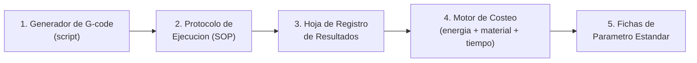

# Plan Maestro: Estandarización, Documentación y Costeo de Pruebas de Corte y Grabado Láser

**Alcance del equipo:** CNC 3018 + módulo láser diodo Laser Tree LT-80W-F45, controlada vía LaserGRBL (GRBL).
**Material de partida:** MDF (varios espesores), diseño extensible a otros materiales.
**Fecha de creación:** 2026-08-28

---

## 1. Objetivo del sistema

Convertir el proceso actual (ajustar parámetros a ojo) en un **sistema repetible** donde:

1. Ejecutar una prueba sea solo **"abrir un G-code y enviarlo en LaserGRBL"** — cero decisiones improvisadas en el taller.
2. Cada prueba quede **documentada** con sus parámetros, resultado visual y costo.
3. Los resultados permitan emitir **"recetas" oficiales** (parámetro estándar por material/espesor/operación) que use cualquier operador.
4. Cada receta tenga un **costo de manufactura conocido**: energía + material + tiempo de máquina.

---

## 2. Arquitectura general (5 piezas)



| Pieza | Qué es | Qué resuelve |
|---|---|---|
| **1. Generador de G-code** | Script (Python) que arma archivos `.nc/.gcode` con grillas de prueba paramétricas y las graba con texto identificador | Elimina el diseño manual de cada prueba; garantiza trazabilidad (cada cupón sabe qué parámetros lo generaron) |
| **2. Protocolo de Ejecución (SOP)** | Checklist paso a paso que sigue el operador en el taller | Que cualquier persona ejecute la prueba igual, sin depender de quién esté ese día |
| **3. Hoja de Registro** | Planilla (Sheets/Excel) donde se anota cada corrida: parámetros, tiempo, energía, evaluación visual | Es la base de datos cruda de la que salen todas las conclusiones |
| **4. Motor de Costeo** | Fórmulas (en la misma hoja o script aparte) que convierten tiempo + kWh + material en costo por pieza | Responde "cuánto cuesta producir esto" |
| **5. Fichas de Parámetro Estándar** | Documento final tipo "receta" por material/espesor/operación, derivado de los datos ya validados | Es lo que usa producción día a día — reemplaza al informe de Gemini del análisis anterior, ahora con datos reales |

---

## 3. Diseño del Generador de G-code (script)

### 3.1 Qué debe producir cada archivo de prueba

Un **cupón de prueba** = una placa con una grilla de cortes/grabados, donde **cada celda de la grilla varía un parámetro** y queda **grabada con su propio ID** (texto láser pequeño junto a la celda, ej. `C-014`), para poder identificar visualmente cada muestra después de cortarla sin tener que llevar cuenta manual de posiciones.

Dos tipos de suite:

**A) Suite de Corte** (por espesor de material)
- Grilla de N velocidades × M potencias, a pasada fija (o pasadas fijas por espesor, según lo ya estimado en el informe previo).
- Cada celda: un cuadrado pequeño (ej. 15×15 mm) cortado a pasante, con el ID grabado al lado (grabado rápido, no afecta el corte).
- Al final del recorrido, un **corte de separación** o un cupón único por celda para poder desprenderlas y evaluarlas individualmente.

**B) Suite de Grabado**
- Grilla de N velocidades × M potencias (rango 15–40% típico), cada celda un cuadro relleno (trama) de tamaño fijo, con su ID al lado.
- Opcional: rampa de escala de grises (para materiales donde interese tono).

### 3.2 Parámetros que el script debe aceptar (config por corrida)

```yaml
material: "MDF Trupan"
espesor_mm: 3.0
operacion: "corte"        # corte | grabado
velocidades_mm_min: [150, 180, 200, 220, 240, 260]
potencias_pct: [70, 80, 90, 100]
pasadas: 1
z_step_mm: 0              # ajuste entre pasadas si pasadas > 1
tamano_celda_mm: 15
espaciado_mm: 5
origen: "esquina_inferior_izq"
id_prefijo: "C"           # C=corte, G=grabado
```

### 3.3 Salida del script

- Un archivo `.gcode` listo para LaserGRBL.
- Un archivo `.csv` **hermano**, con una fila por celda: `id, velocidad, potencia, pasadas, x, y` — esta es la clave que conecta el G-code con la hoja de registro (se importa directo a la Hoja de Registro sin transcribir a mano).

### 3.4 Nomenclatura estándar de archivos

```
<material>_<espesor>mm_<operacion>_<fecha>_<lote>.gcode
Ej: MDF-Trupan_3.0mm_corte_2026-08-28_L01.gcode
```

Esto por sí solo ya estandariza cómo se nombran y archivan las pruebas.

---

## 4. Protocolo de Ejecución (SOP) — lo que hace el operador

1. **Preparar material**: cortar la placa al tamaño del cupón de prueba, identificar el lote/proveedor.
2. **Fijar y calibrar**: nivelar, ajustar foco (galga), fijar origen de trabajo (X0 Y0).
3. **Registrar estado inicial**:
   - Anotar hora de inicio.
   - **Lectura de energía**: si el enchufe inteligente tiene contador acumulado (kWh totales), anotar el valor *antes* de iniciar. Si no, anotar solo hora de inicio (el costo se estimará por tiempo × potencia nominal como respaldo — ver §6.3).
4. **Cargar y enviar el G-code** en LaserGRBL (sin tocar nada del archivo).
5. **Al finalizar**:
   - Anotar hora de fin (LaserGRBL muestra tiempo transcurrido: usar ese dato como fuente primaria de tiempo de máquina).
   - Lectura de energía final (kWh acumulados) o revisar consumo de la corrida en la app del enchufe si el rango de tiempo es identificable.
6. **Evaluar el cupón** (offline, sin máquina):
   - Foto del cupón completo con buena luz.
   - Por cada celda: ¿corte pasante? (sí/no), carbonización (escala 1–5), notas.
7. **Cargar resultados** a la Hoja de Registro (importando el `.csv` hermano + agregando las columnas de evaluación y energía).

> Este SOP es el documento que se cuelga físicamente en el taller — una sola página, checklist.
> Versión imprimible ya lista: [`docs/sop/SOP-corrida-de-prueba.md`](sop/SOP-corrida-de-prueba.md) (Fase F3).

---

## 5. Hoja de Registro de Resultados

Una fila = una **celda de prueba** (no una corrida completa). Columnas propuestas:

| Columna | Fuente | Ejemplo |
|---|---|---|
| `id_prueba` | csv hermano del gcode | C-014 |
| `lote` | nombre de archivo | L01 |
| `fecha` | manual/automática | 2026-08-28 |
| `material` | config del script | MDF Trupan |
| `espesor_mm` | config | 3.0 |
| `operacion` | config | corte |
| `velocidad_mm_min` | csv hermano | 220 |
| `potencia_pct` | csv hermano | 100 |
| `pasadas` | csv hermano | 1 |
| `corte_pasante` | evaluación manual | sí |
| `carbonizacion_1a5` | evaluación manual | 2 |
| `tiempo_corrida_min` | LaserGRBL (tiempo total de la suite, prorrateado) | — |
| `kwh_corrida` | medidor (total de la suite, prorrateado) | — |
| `costo_energia` | fórmula (§6) | — |
| `costo_material` | fórmula (§6) | — |
| `costo_tiempo_maquina` | fórmula (§6) | — |
| `costo_total_pieza` | fórmula (§6) | — |
| `foto` | link/archivo | IMG_014.jpg |
| `notas` | manual | — |

**Nota clave sobre el medidor:** como la suite corre celdas en un solo G-code continuo, el kWh y el tiempo se miden **por corrida completa**, no por celda individual. Se prorratea el costo entre celdas usando el **tiempo estimado de cada segmento** (el script generador ya conoce cuánto dura cada celda teóricamente, a partir de velocidad y distancia recorrida — esto lo calculamos en el propio script y lo agregamos al csv hermano como `tiempo_estimado_celda_s`).

---

## 6. Motor de Costeo

### 6.1 Costo de energía

```
costo_energia_corrida = kwh_corrida × tarifa_electrica ($/kWh)
costo_energia_celda   = costo_energia_corrida × (tiempo_estimado_celda / tiempo_total_corrida)
```

Si no hay lectura de kWh disponible (medidor no configurado ese día), respaldo:
```
kwh_estimado = (potencia_nominal_modulo_W / 1000) × (tiempo_corrida_h) × factor_utilizacion
```
donde `factor_utilizacion` es la fracción de tiempo que el láser dispara realmente (PWM efectivo aprox.) — se calibra una vez comparando contra lecturas reales del medidor, y ese valor calibrado queda documentado.

### 6.2 Costo de material

```
costo_material_celda = area_o_perimetro_celda × precio_unitario_material
```
- Corte: precio por **área de placa consumida** (incluye desperdicio de la grilla, no solo la pieza útil).
- Grabado: no consume material (costo material = 0, solo energía + tiempo).

### 6.3 Costo de tiempo de máquina

```
costo_tiempo_maquina_celda = tiempo_estimado_celda_h × tarifa_hora_maquina
```
`tarifa_hora_maquina` = depreciación del equipo + mantenimiento + (opcional) mano de obra del operador, expresada en $/hora. Este valor se define una sola vez como parámetro de negocio (no se mide por prueba).

### 6.4 Costo total

```
costo_total_pieza = costo_energia_celda + costo_material_celda + costo_tiempo_maquina_celda
```

> **Insumos que hay que definir una sola vez** (los dejamos como parámetros configurables en la hoja, no hardcodeados): tarifa eléctrica ($/kWh de tu recibo), precio por m² de cada material, tarifa_hora_maquina.

---

## 7. De datos crudos a Fichas de Parámetro Estándar

Con la Hoja de Registro llena para un material/espesor:

1. Filtrar celdas con `corte_pasante = sí` y `carbonizacion_1a5 ≤ umbral aceptable`.
2. De las que pasan el filtro, elegir la de **mayor velocidad** (mejor throughput) salvo que el costo total no compense (a veces bajar potencia y subir tiempo da menor costo si la energía pesa más que el tiempo — el motor de costeo lo decide, no el ojo).
3. Esa combinación (velocidad, potencia, pasadas) se convierte en la candidata de la **Ficha de Parámetro Estándar** de ese material/espesor/operación — pero el número de energía/costo que se documenta ahí sale de una **Final Run** (sección 10), no del barrido: el barrido sirve para *elegir* la combinación, la Final Run para *medirla* con precisión.
4. Las fichas se versionan (v1, v2…) cada vez que se re-testea (nuevo lote de material, ajuste de firmware, etc.).

---

## 8. Final Run: energía calibrada para producción

### 10.1 El problema que resuelve

Una suite de barrido (secciones 3–6) mezcla, en una sola corrida, celdas con **velocidades y potencias distintas**. El medidor solo da un total de kWh para toda la corrida, así que el reparto entre celdas se hace por **peso de tiempo** (`tiempo_estimado_celda_s`), no por potencia real. Esto es una aproximación razonable para *comparar* combinaciones entre sí, pero produce un artefacto: dos celdas de igual duración y distinta potencia reciben el mismo costo de energía, aunque hayan consumido corriente distinta.

Una vez que el barrido ya hizo su trabajo (elegir la combinación ganadora), ese artefacto deja de ser aceptable para el número que se entrega a producción/financiero.

### 10.2 Qué es una Final Run

Una corrida que usa **una sola combinación fija** de velocidad/potencia — la ya elegida — repetida en **celdas físicamente idénticas** (`repeticiones`, default 5). Como todas las celdas pesan exactamente igual, el reparto del kWh medido dentro de esa corrida deja de ser una aproximación: es una división exacta.

Eso resuelve la variación *dentro* de una corrida. Para la variación *entre* corridas (calentamiento de la máquina, voltaje de la red, desgaste de la lente, etc.), la misma Final Run se ejecuta **como mínimo 3 veces de forma independiente** (`ejecucion` = 1, 2, 3…), cada una un job físico separado con su propia lectura de medidor de inicio a fin.

### 10.3 Flujo de comandos

```
uv run laser-toolkit generate-final-run configs/<material>_final_run.yaml --ejecucion 1
# ... correr en la máquina, medir (SOP), evaluar ...
uv run laser-toolkit prepare-record data/registros/FINAL_..._ejec1.csv
# completar kwh_corrida_medido y tiempo_real_corrida_s en el _registro.csv

# repetir con --ejecucion 2, --ejecucion 3, en momentos independientes

uv run laser-toolkit summarize-final-run \
    data/registros/FINAL_..._ejec1_registro.csv \
    data/registros/FINAL_..._ejec2_registro.csv \
    data/registros/FINAL_..._ejec3_registro.csv
```

`summarize-final-run` agrupa por `grupo_calibracion_id` (material + espesor + operación + velocidad + potencia, sin importar fecha ni ejecución) y calcula, entre ejecuciones: **kWh por unidad** y **tiempo por unidad**, cada uno con su **desviación estándar** y **coeficiente de variación (CV%)**. Reporta `CALIBRADO` solo si hay al menos las ejecuciones mínimas configuradas (default 3, `--minimo-ejecuciones`); si no, dice cuántas faltan.

### 10.4 A dónde va el resultado

El kWh/unidad y tiempo/unidad calibrados de una Final Run **son** el dato de energía que se documenta en la Ficha de Parámetro Estándar (F6) — no una nueva estimación, sino la medición directa de exactamente la combinación que se va a usar en producción. El CV% queda como evidencia de qué tan confiable es ese número (un CV alto indica que algo más inestable está pasando en el proceso, vale la pena investigar antes de confiar en el promedio).

---

## 9. Roadmap de implementación (fases)

| Fase | Entregable | Depende de | Estado |
|---|---|---|---|
| **F1** | Script generador de G-code (grillas de corte y grabado) + csv hermano | — | Listo — paquete `laser_toolkit` (ver `README.md`) |
| **F2** | Hoja de Registro + motor de costeo | F1 (columnas del csv) | Listo — `laser-toolkit prepare-record` / `compute-costs`, separados en `io/registro.py` y `costos.py`. Se implementó como extensión del toolkit (no como planilla aparte) para mantener un único pipeline con tests y tipado |
| **F3** | SOP de una página para el taller | F1 + F2 | Listo — `docs/sop/SOP-corrida-de-prueba.md` |
| **F4** | Primera corrida piloto en MDF 3mm (validación end-to-end del flujo completo) | F1, F2, F3 | **Listo** — 23 corridas reales de barrido (corte y grabado, MDF Comercial y Trupan), la mayoría con `kwh_corrida_medido` y evaluación completa. El fix `overscan real + límite de velocidad + punto focal` salió justamente de este ciclo real |
| **F5** | Calibración del factor de energía mediante Final Run (sección 8) | F4 | Barrido listo — `generate-final-run`/`summarize-final-run`. Pendiente real: hay 7 candidatos marcados desde la Hoja de Registro, pero ninguna Final Run generada/ejecutada todavía |
| **F6** | Ficha de Parámetro Estándar v1 para MDF (todos los espesores) | F4, F5, repetido por espesor | Pendiente. Persistencia decidida: datos estructurados (JSON/YAML), no Markdown a mano — la UI de "Fichas" (Prompt 12) los renderiza directo |
| **F7** | Extender a un segundo material (validar que el sistema es agnóstico) | F6 | Pendiente. Material elegido: carcasas de teléfono en TPU/silicona (familia polímero) — primera vez que se prueba un material no-madera; confirmar ficha de seguridad antes de la primera corrida (fume/ventilación distintos al MDF) |

---

## 10. Pendientes de negocio (autoservicio del área financiera)

Estos valores no los define el desarrollo del toolkit; el desarrollo solo garantiza que
la cantidad física que cada uno multiplica esté medida y sea granular. Se completan
copiando `configs/tarifas.example.yaml` a `configs/tarifas.yaml` (ese archivo no se
sube a git — ver `.gitignore`):

- Tarifa eléctrica vigente ($/kWh) → multiplica `kwh_celda`.
- Precio de compra del material por espesor (por m²) → multiplica `area_material_mm2`.
- Tarifa hora-máquina (depreciación + mantenimiento + opcional mano de obra) → multiplica `tiempo_maquina_celda_s`.

Mientras un campo quede en `null`, `laser-toolkit compute-costs` deja esa columna de
costo vacía en el csv de salida en vez de asumir un valor — nunca hay que "avisar" para
que el sistema funcione con datos parciales.

**Umbral de aceptación de carbonización** (Fase F6/F7), ya definido: `carbonizacion_1a5 ≤ 3`, tanto en corte como en grabado. En grabado este umbral tiene una lectura distinta a la de corte: no busca *ausencia* de carbonización (el grabado la produce por diseño), sino distinguir un grabado controlado de una quema indiscriminada del material.

---

## 11. Grabado vectorial de SVG

### 11.1 Por qué

Casi todo grabado real de producción parte de un arte vectorial (logo, icono, texto convertido a curvas) en formato SVG, no de un relleno genérico sobre un cuadrado. El sistema necesitaba una forma de:

1. Probar parámetros de grabado (velocidad/potencia) usando la geometría **real** que se va a grabar en producción, no un sustituto.
2. Convertir cualquier SVG a G-code como utilidad **independiente**, reutilizable en integraciones futuras (una cola de trabajos, un pipeline de personalización de producto, etc.) sin arrastrar el resto del sistema de pruebas.

### 11.2 Diseño

`laser_toolkit.svg` es un parser SVG propio (sin dependencias externas), separado en piezas atómicas:

- `path_parser.py` — atributo `d` de `<path>` (M/L/H/V/C/S/Q/T/Z, absolutos y relativos).
- `document.py` — documento SVG completo (`viewBox` + `path`/`ellipse`/`circle`/`rect`/`line`/`polyline`/`polygon`).
- `bezier.py` — aplanado de curvas cúbicas/cuadráticas a segmentos rectos.
- `transform.py` — escala el `viewBox` a una caja `ancho_mm x alto_mm` (proporción preservada, centrado), voltea el eje Y.
- `fill.py` — relleno vectorial por barrido de líneas horizontales, regla par-impar (maneja formas separadas y huecos correctamente).
- `gcode.py` — emisión de G-code de contorno y de relleno.
- `api.py` — `cargar_subpaths_svg` (geometría pura, sin G-code) y `convertir_svg_a_gcode` (función atómica de conversión completa), pensadas para integraciones que no pasen por el resto del toolkit.

No soportado (falla con error explícito, nunca dibuja mal en silencio): arcos SVG (`A`/`a`) y el atributo `transform` en cualquier elemento.

### 11.3 Dos formas de uso

1. **Herramienta suelta**: `laser-toolkit svg-to-gcode <archivo.svg> --ancho-mm --alto-mm --velocidad --potencia -o salida.gcode`. No depende de `SuiteConfig` ni de ningún otro concepto del sistema de pruebas.
2. **Integrado en una suite de barrido**: `SuiteConfig.svg_path` hace que la suite use ese SVG —escalado a `tamano_celda_mm`— en cada celda de la grilla, en vez de la geometría genérica. En **grabado**, `generar_suite_grabado` respeta `modo_grabado_svg` (`contorno`, `relleno`, `contorno_y_relleno`) y `svg_resolucion_relleno_mm`. En **corte**, `generar_suite_corte` siempre traza solo el **contorno** del SVG (ignora `modo_grabado_svg`: cortar no admite relleno tipo trama, no tiene sentido físico "cortar un rayado"), repetido `pasadas` veces igual que el cuadrado genérico — el área de material cobrada sigue siendo la celda completa, no el área encerrada por la forma (sección 6.2). El resto del pipeline (csv hermano, `prepare-record`, `compute-costs`) funciona exactamente igual, sin cambios.

### 11.4 Archivo de referencia

`assets/svg/logo-empresa.svg` es el SVG por defecto del sistema para pruebas de grabado — el formato que se usa casi el 100% de las veces en producción. `configs/ejemplo-dev_logo_grabado.yaml` es la suite de ejemplo que lo usa.
