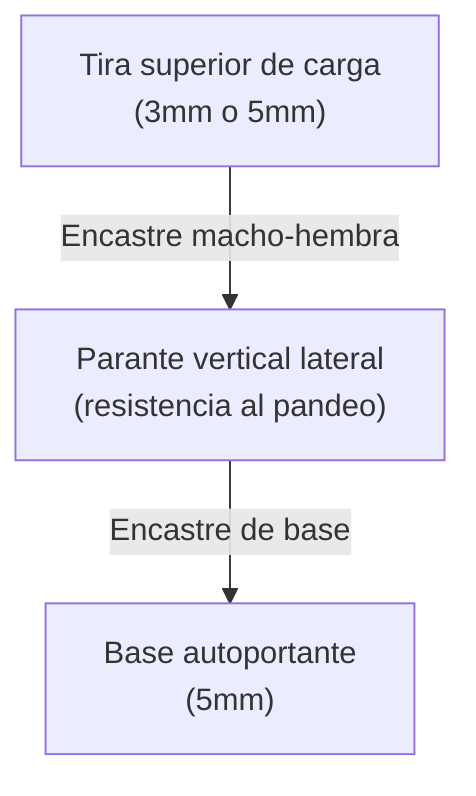

# Análisis Técnico y Mecánico de Procesamiento de MDF con Láser Diodo LT-80W-F45 en Plataforma CNC 3018 para Producción Comercial

## Parámetros Optomecánicos del Módulo LT-80W-F45 y Comportamiento Térmico del MDF

El módulo de grabado y corte Laser Tree LT-80W-F45 integra una potencia óptica continua de $10\text{ W} (\pm 1\text{ W})$, obtenida mediante la combinación de dos diodos láser de $5\text{ W}$ proyectados a través de una lente de enfoque de haz comprimido[^1]. Esta configuración óptica produce un punto focal (*spot*) comprimido de $0.08 \times 0.08\text{ mm}$, operando a una longitud de onda visible de $450\text{ nm}$ y una distancia focal fija de $45\text{ mm}$[^1]. La densidad de energía por unidad de área resultante en el plano de enfocado permite la sublimación y vaporización térmica directa de las fibras lignocelulósicas del Tablero de Fibra de Densidad Media (MDF)[^2].

El comportamiento termomecánico del MDF ante la radiación infrarroja-azul depende críticamente del grosor de la lámina y de la relación entre la tasa de avance angular y la modulación por ancho de pulso (PWM) suministrada al controlador[^1]. En espesores reducidos como $2.0\text{ mm}$ y $3.0\text{ mm}$, el haz óptico logra penetrar la totalidad de la matriz de fibra aglomerada en una sola pasada a velocidades viables para la fabricación comercial[^2]. A medida que el espesor se incrementa hacia los $5.0\text{ mm}$ o $6.0\text{ mm}$, la acumulación de carbón en las paredes del corte (*kerf*) dispersa el haz, requiriendo múltiples pasadas térmicas y reduciendo significativamente la velocidad global de producción[^6].

| Grosor de MDF | Potencia Láser (%) | Velocidad Óptima (mm/min) | Número de Pasadas | Ajuste de Z por Pasada | Rendimiento Térmico / Estado del Borde |
| :---- | :---- | :---- | :---- | :---- | :---- |
| **2.0 mm** | 90 - 100% | 280 - 320 | 1 | N/A | Carbonización mínima, bordes de tono café claro[^2] |
| **3.0 mm** | 100% | 200 - 240 | 1 | N/A | Borde tostado limpio, alta precisión dimensional[^2] |
| **4.0 mm** | 100% | 150 - 180 | 2 | $-0.5\text{ mm}$ (pasada 2) | Carbonización moderada, requiere alto flujo de aire[^1] |
| **5.0 mm** | 100% | 180 - 200 | 2 | $-1.0\text{ mm}$ (pasada 2) | Carbonización visible, requiere limpieza poscorte[^2] |
| **6.0 mm** | 100% | 120 - 140 | 3 - 4 | $-0.8\text{ mm}$ por pasada | Elevada deposición de hollín, baja viabilidad comercial[^6] |
| **9.0 mm +** | 100% | 100 - 120 | 8 - 10 | $-1.0\text{ mm}$ por pasada | Inviable industrialmente por exceso de llama y resina[^2] |

Para la ejecución de grabado superficial sobre MDF, el plano focal debe posicionarse exactamente en la superficie superior del tablero ($0\text{ mm}$ de desfase)[^1]. La modulación del pulso entre 20% y 35% de potencia a velocidades de avance comprendidas entre $1000$ y $1500\text{ mm/min}$ produce un entonado tostado homogéneo de alta contraste sin degradar la resolución de vector o imagen de trama[^1].

## Evaluación Mecánica y Estructural de Cuadros Multicapa y Cajas de Sombra

Los cuadros artísticos multicapa y las cajas de sombra (*shadow boxes*) basan su viabilidad comercial en el relieve tridimensional, el juego de sombras y la integración de iluminación perimetral o posterior. El análisis de resistencia mecánica indica que la rigidez de una estructura laminada no depende únicamente del espesor de una lámina individual, sino del momento de inercia ($I$) de la sección transversal acumulada de las capas unidas mediante adhesivo.

La rigidez a la flexión de una sección rectangular se define mediante la ecuación:

$$I = \frac{b \cdot h^3}{12}$$

Donde $b$ representa el ancho de la pieza y $h$ el grosor total del apilamiento. Al superponer e interconectar múltiples estratos cortados de forma independiente utilizando polímeros cruzados (como acetato de polivinilo estructural o cianocrilato de alta viscosidad), el momento de inercia crece exponencialmente con el cubo del espesor acumulado.

En proyectos decorativos multicapa construidos a partir de placas de $3\text{ mm}$ de MDF (tales como cuadros con temáticas astronómicas o escenas de la naturaleza), la colocación consecutiva de 4 a 6 capas genera un espesor compuesto de $12\text{ mm}$ a $18\text{ mm}$. Este apilamiento ofrece ventajas mecánicas y ópticas fundamentales:

- **Estabilidad Dimensional:** Aunque una hoja aislada de MDF de $3\text{ mm}$ en formatos superiores a $20 \times 20\text{ cm}$ posea cierta flexibilidad tangencial, la laminación en capas cruzadas elimina por completo la tendencia al pandeo, produciendo un bloque estático indeformable[^10].
- **Profundidad Óptica e Iluminación:** El volumen interno creado por las capas de $3\text{ mm}$ actúa como una cámara de amortiguación fotónica. Este espacio permite alojar tiras de diodos LED en el contorno posterior o intermedio sin que los puntos de emisión directa de luz proyecten sombras duras sobre los planos frontales calados.
- **Eficiencia en la Maquinación:** El uso de MDF de $3\text{ mm}$ representa el punto óptimo de operabilidad para el módulo LT-80W-F45, ya que permite cortar geometrías intrincadas y curvas de radio pequeño en una única pasada rápida[^2]. Esto evita la deformación de detalles finos causada por la reexposición térmica de una segunda pasada.

## Rigidez Mecánica y Soporte de Carga en Exhibidores Autoportantes

Los productos autoportantes ensamblables mediante encastres machiembrados o ranuras *tab-and-slot* (como percheros para joyería, exhibidores de mesa o soportes de exhibición comercial) están sometidos a cargas de cizallamiento y flexión en sus puntos de contacto. La selección del grosor del MDF en estas aplicaciones condiciona la estabilidad vertical y la durabilidad del encastre frente al desgaste por montaje y desmontaje.

### Comportamiento del MDF de $3\text{ mm}$ en Estructuras Verticales

- **Limitaciones Mecánicas:** En parantes verticales con alturas superiores a $15\text{ cm}$, el MDF de $3\text{ mm}$ exhibe una rigidez torsional limitada. El área de fricción dentro de las ranuras de encastre ($3\text{ mm}$ de profundidad de contacto) resulta insuficiente para amortiguar el momento flector generado al colgar objetos pesados, lo que puede provocar holguras, inclinaciones de la base o grietas en las lengüetas de ensamble[^10].
- **Ventajas en Componentes:** Su menor espesor es ideal para fabricar accesorios livianos suspendidos, como minicolgadores de pendientes o piezas de interconexión secundaria donde se requiera reducir el peso total del conjunto[^10].

### Comportamiento del MDF de $5\text{ mm}$ en Estructuras Verticales

- **Ventajas Mecánicas:** Al incrementar el espesor a $5\text{ mm}$, el módulo de sección flectora ($Z = \frac{b \cdot h^2}{6}$) se incrementa en aproximadamente un $177\%$ respecto al de $3\text{ mm}$. La pared de encastre ofrece $5\text{ mm}$ de profundidad de contacto, distribuyendo la carga perpendicular de manera uniforme y previniendo el balanceo estructural del exhibidor[^10].
- **Costo de Maquinado:** El corte de MDF de $5\text{ mm}$ mediante el diodo de $10\text{ W}$ requiere obligatoriamente dos pasadas a velocidades de $180\text{ a } 200\text{ mm/min}$, aumentando el tiempo de máquina por unidad producida y generando bordes con un grado mayor de carbonización que exige procesos de limpieza poscorte[^2].

### Arquitectura Constructiva Híbrida

Para optimizar el rendimiento térmico y la solidez mecánica, el diseño de exhibidores autoportantes debe basarse en un esquema híbrido:

1. **Bases y Parantes de Carga:** Fabricados en **MDF de $5\text{ mm}$** para asegurar la estabilidad gravitacional, la fricción de encastre y la rigidez lateral del chasis[^10].
2. **Perchas y Elementos Suspendidos:** Fabricados en **MDF de $3\text{ mm}$** para maximizar la velocidad de corte por láser, reduciendo el peso de la estructura superior y manteniendo la nitidez en detalles geométricos de menor tamaño[^10].

## Caracterización de Materiales: MDF Estándar vs. MDF Grado Láser y Trupan

La composición química y la densidad física del tablero de MDF determinan la eficiencia del proceso de vaporización por diodo de $450\text{ nm}$. El MDF convencional para carpintería general se fabrica compactando fibras de madera dura con elevadas proporciones de aglutinantes de urea-formaldehído (UF) y ceras minerales para otorgarle resistencia a la humedad[^5]. Al ser expuestas al rayo láser, estas resinas sintéticas no se vaporizan limpiamente; en su lugar, se funden, liberando humo denso, gases nocivos y alquitrán pegajoso que carboniza los bordes del corte[^5].

Por el contrario, el **MDF Grado Láser** o el **MDF Trupan (Ultra Light / NAF - No Added Formaldehyde)** sustituyen los ligantes sintéticos densos por resinas orgánicas de alta tasa de sublimación y utilizan fibras de madera blanda de menor densidad aparente[^5].

| Parámetro Técnico | MDF Estándar (Ferretero / Comercial) | MDF Grado Láser / Trupan Light (NAF) | Impacto en la Operación y Costes de Taller |
| :---- | :---- | :---- | :---- |
| **Densidad Aparente** | Elevada ($750 - 800\text{ kg/m}^3$) | Reducida / Moderada ($500 - 600\text{ kg/m}^3$) | El MDF ligero requiere hasta un 35% menos de energía térmica para la sublimación de fibra[^13]. |
| **Agente Aglomerante** | Urea-Formaldehído denso con ceras[^5] | Resinas de bajo contenido de formaldehído (NAF/PMDI)[^5] | Disminuye la emisión de humos tóxicos y reduce la acumulación de alquitrán en la máquina[^5]. |
| **Calidad del Borde Cortado** | Negro carbonizado, suelta hollín al tacto[^12] | Tono canela / tostado claro, residuos secos[^12] | Elimina o reduce sustancialmente el tiempo de lijado y limpieza manual posprocesamiento[^12]. |
| **Impacto en la Óptica Láser** | Evaporación aceitosa que empaña la lente[^12] | Residuos volátiles secos de fácil extracción[^2] | Preserva la transmitancia de la lente protectora del módulo LT-80W-F45[^1]. |
| **Velocidad de Maquinado** | Requiere velocidades bajas y múltiples pasadas[^6] | Permite avanzar a la máxima velocidad nominal de la tabla[^2] | Incrementa el número de piezas cortadas por hora de máquina. |

## Mecanismos de Deformación del MDF y Protocolos Prevencionistas

El MDF es un material de estructura porosa altamente higroscópico. Las planchas de espesor delgado ($2.0\text{ mm}$ a $4.0\text{ mm}$) absorben y liberan humedad ambiental de forma asimétrica a través de sus caras, lo que genera tensiones internas de expansión o contracción que derivan en la deformación o curvatura (*warping*) del tablero.

El fenómeno de deformación se origina principalmente por tres factores de proceso:

1. **Desbalance Higroscópico:** Cuando una lámina se almacena sobre una superficie húmeda o expuesta al aire solo por una de sus caras, la absorción diferencial de agua expande la cara expuesta mientras la cara aislada mantiene su dimensión, generando un perfil cóncavo o convexo.
2. **Gradiente Térmico por Láser:** La vaporización focalizada introduce una temperatura superior a los $400^\circ\text{C}$ a lo largo de los vectores de corte. Este choque térmico elimina el agua constitucional de las fibras adyacentes a la sangría en la cara superior, tensionando el perímetro al enfriarse.
3. **Pérdida de Masa en Diseños Calados:** La remoción masiva de material en patrones intrincados reduce la continuidad geométrica de la placa, haciendo que cualquier tensión residual interna deforme el marco exterior.

### Protocolos de Mitigación en Taller

- **Sellado e Imprimación Previa:** Aplicar una capa homogénea de sellador para madera (*sanding sealer*), barniz sintético base agua o imprimación transparente en spray sobre **ambas caras** de la plancha antes de pasarla al corte láser. El sellado crea una barrera hidrófoba idéntica en ambas superficies, bloqueando el intercambio higroscópico ambiental.
- **Almacenamiento Plano con Carga:** Las placas de MDF deben conservarse perfectamente horizontales, elevadas del suelo sobre tarimas planas y sometidas a peso distribuido uniformemente sobre la parte superior para neutralizar cualquier memoria de curvatura del material.
- **Orientación Cruzada en Laminación:** Al ensamblar proyectos multicapa (como los cuadros de las imágenes 1 y 2), cada capa consecutiva debe rotarse $90^\circ$ con respecto al sentido de fabricación de la plancha anterior antes de aplicar el adhesivo. Este principio de contrachapado anula los momentos de deformación lateral entre capas.

## Integración Kinemática y Productiva en la Plataforma CNC 3018

La instalación del módulo láser diódico Laser Tree LT-80W-F45 sobre la estructura de una grabadora/fresadora CNC 3018 impone ciertas condiciones cinemáticas y neumáticas que deben ser ajustadas para maximizar la calidad de los cortes y extender la vida útil del equipo[^1].

### Dinámica de los Ejes y Calibración de Firmware

Las máquinas tipo CNC 3018 emplean husillos de rosca trapezoidal T8 impulsados por motores paso a paso NEMA 17 para el desplazamiento en los ejes X, Y y Z. A diferencia de las cortadoras láser impulsadas por correas dentadas (que alcanzan altas velocidades de desplazamiento pero poseen menor fuerza de retención), la tracción por husillo T8 ofrece una elevadísima precisión dimensional a velocidades moderadas ($F \le 1000 - 1500\text{ mm/min}$).

Dado que el módulo LT-80W-F45 posee un peso mecánico de $250\text{ g}$, la inercia del cabezal sobre el eje X durante cambios bruscos de dirección puede generar microvibraciones en la estructura de aluminio[^1]. Se recomienda ajustar los parámetros de aceleración en el firmware GRBL (`$120` para el eje X y `$121` para el eje Y) a valores situados entre $50\text{ mm/s}^2$ y $100\text{ mm/s}^2$. Esto garantiza trayectorias suaves en vectores cerrados y evita marcas de oscilación en las paredes del corte.

### Sistema de Asistencia de Aire (*Air Assist*)

El procesado de MDF con módulos de diodo de $10\text{ W}$ requiere indispensablemente un flujo de aire constante enfocado en la zona de corte[^1]. Las resinas volátiles del MDF se condensan rápidamente sobre la superficie del cristal protector del láser, reduciendo drásticamente la potencia óptica de salida si no se cuenta con protección neumática[^12].

- **Requerimiento Neumático:** Se debe disponer de una bomba de aire que suministre un caudal continuo no menor a $27\text{ L/min}$ y una presión mínima de $0.027\text{ kPa}$ ($0.27\text{ bar}$)[^1].
- **Acción Hidrodinámica:** La boquilla integrada de $6\text{ mm}$ del LT-80W-F45 dirige el chorro de aire a alta velocidad hacia la sangría de corte[^2]. Esta acción remueve de forma inmediata el alquitrán y las partículas en suspensión, extingue la combustión incipiente en los bordes y previene la flama visible, obteniendo cortes limpios y de color tostado uniforme[^2].

### Control Focal en el Eje Z (*Z-Stepping*)

La distancia focal del módulo es de $45\text{ mm}$[^1]. Para el corte de MDF de $3\text{ mm}$ en una pasada, se debe emplear una galga de calibración de $4\text{ mm}$ entre la boquilla de aire y la cara superior del material, situando la cintura del haz focalizado a $-1.0\text{ mm}$ dentro del tablero[^1]. Para el corte de MDF de $5\text{ mm}$ ejecutado en dos pasadas, es aconsejable programar un descenso del eje Z de $+1.5\text{ mm}$ en el firmware para la segunda pasada[^6]. Esto reubica el punto de máxima intensidad fotónica en el centro del grosor restante del material[^6].

## Síntesis Técnica y Matriz de Decisión Comercial

Para optimizar los tiempos de maquinado, asegurar la solidez estructural de los proyectos comerciales presentados y garantizar el rendimiento del módulo Laser Tree LT-80W-F45 instalado en la CNC 3018, se resumen las directrices de fabricación en la siguiente matriz de decisión:

| Línea de Producto (Basado en Imágenes) | Grosor Sugerido | Variedad de MDF Recomendada | Configuración de Maquinado (LT-80W-F45) | Evaluación Comercial y Estructural |
| :---- | :---- | :---- | :---- | :---- |
| **Cuadros Multicapa 3D / Cajas de Sombra (Luz LED)** *(Imágenes 1 y 2)* | **3.0 mm** | Trupan / NAF Grado Láser | **Corte:** 200-240 mm/min, 100% Potencia, 1 Pasada. **Grabado:** 1200 mm/min, 25% Potencia. | **ÓPTIMA.** Excelente velocidad de corte, rigidez total al apilar capas y sin deformación tras el encolado[^2]. |
| **Exhibidores de Joyería / Percheros Autoportantes** *(Imagen 3)* | **Estructura Híbrida** (Base 5 mm / Perchas 3 mm) | MDF Grado Láser o Estándar sellado | **Base (5 mm):** 180 mm/min, 100% Potencia, 2 Pasadas. **Perchas (3 mm):** 240 mm/min, 100% Potencia, 1 Pasada. | **ALTA.** Entrega máxima estabilidad mecánica en la base sin balanceo de encastres, optimizando el tiempo de corte global[^2]. |
| **Cajas Decorativas con Encastre Directo (Finger Joints)** | **3.0 mm a 4.0 mm** | Trupan Light / NAF | **Corte (3 mm):** 220 mm/min, 1 Pasada. **Corte (4 mm):** 160 mm/min, 2 Pasadas. | **ALTA.** Requiere aplicar en el diseño una compensación de corte (*kerf offset*) de $0.08 - 0.10\text{ mm}$ para ensambles firmes. |
| **Estructuras Monolíticas de Gran Tamaño ($>6.0\text{ mm}$)** | **No Recomendado** | Cualquier variante de MDF | Requiere $\ge 4$ pasadas lentas ($<120\text{ mm/min}$). | **INVIABLE.** Tiempos de máquina excesivos, alta carbonización y riesgo de ignición por calor acumulado[^6]. |

### Recomendaciones Tácticas para el Taller

1. **Material Base Predeterminado:** Adquirir **MDF Trupan Light o NAF Grado Láser de $3.0\text{ mm}$** como insumo principal de producción[^5]. Este grosor permite cubrir más del 80% de los productos decorativos, optimizando la velocidad del diodo de $10\text{ W}$ en pasadas únicas y libres de hollín[^2].
2. **Refuerzo Selectivo de Estructuras:** Reservar el uso de placas de **MDF de $5.0\text{ mm}$ únicamente para las bases horizontales y soportes verticales** de muebles o exhibidores autoportantes, garantizando encastres a presión sólidos y resistentes a cargas de flexión[^10].
3. **Control Operativo Continuo:** Operar el sistema manteniendo activa la asistencia de aire a un caudal superior a $27\text{ L/min}$[^1]. Esto mantendrá los bordes limpios, garantizará la repetibilidad de los encastres y protegerá la óptica del módulo diódico durante jornadas continuas de fabricación[^2].

## Referencias

[^1]: LASER TREE LT-80W-F45 Laser Module User Manual - Manuals.plus, <https://manuals.plus/m/e35da4d827cfa383f90e404c927dd138af12b85baacf980b2bbe76fd85aa19f0>
[^2]: 10W/5W Laser Module for 3018 CNC, with Air Assist, <https://lasertree.com/products/laser-tree-10w-cnc3018-optical-output-power-laser-module>
[^3]: LASER TREE 10W Optical Power Laser Engraver Cutting Module, <https://www.ebay.com/itm/286725714505>
[^4]: LASER TREE CNC 3018 Laser Module Kit 10 W Optical Zambia, <https://www.ubuy.com.zm/productde/IDWJVHL20-laser-tree-cnc-3018-laser-module-kit-10-w-optical-power-laser-head-with-air-support-fixed-focal-length-45-mm-laser-engraving-module-double-point>
[^5]: Is it safe to laser cut MDF? Everything You Need To Know, <https://laserengravingtips.com/is-it-safe-to-laser-cut-mdf/>
[^6]: How to 'cut out' a shape from 3mm mdf or 5mm ply, <https://forum.lightburnsoftware.com/t/how-to-cut-out-a-shape-from-3mm-mdf-or-5mm-ply/55084>
[^7]: Tabla de Parámetros para Láser Diodo 10W: Corte y Grabado, <https://colormake.com/blog/tabla-de-parametros-para-laser-diodo-10w-corte-y-grabado-color-make/>
[^8]: Can't cut 10w diode : r/lasercutting - Reddit, <https://www.reddit.com/r/lasercutting/comments/1f5llrt/cant_cut_10w_diode/>
[^9]: I have a 5 w diode laser, what parameters should I use to cut 3mm, <https://www.reddit.com/r/lasercutting/comments/1h57b58/i_have_a_5_w_diode_laser_what_parameters_should_i/>
[^10]: Best materials for laser cut boxes: MDF, plywood, and acrylic, <https://box-studio.cc/blog/2026-04-en-best-materials-laser-cut-boxes>
[^11]: What thickness of material do you use the most? - Reddit, <https://www.reddit.com/r/lasercutting/comments/1jalihz/what_thickness_of_material_do_you_use_the_most/>
[^12]: Laser Cutting MDF: The Complete Guide For Perfect Results Every, <https://www.hflaser.com/laser-cutting-mdf-the-complete-guide-for-perfect-results-every-time.html>
[^13]: PANEL DE MDF 3 MM 1.22 X 2.44 M ARAUCO, <https://pro.homedepot.com.mx/pro/materiales-de-construccion/paneles-de-madera/mdf/mdf-3mm-122x244-286133>
[^14]: LASER TREE LT-80W-F45 Laser Engraving Module with Air Assist, <https://manuals.plus/laser-tree/lt-80w-f45-laser-engraving-module-with-air-assist-manual>
