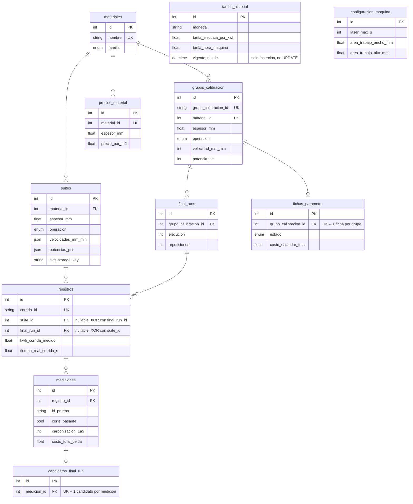

# Schema de Supabase (issue #1, diseñado en #22)

Los modelos SQLAlchemy en `packages/laser_toolkit/src/laser_toolkit/db/models.py` son la fuente de verdad — este documento es el mapa para orientarse rápido, no una copia a mantener en paralelo.

## Diagrama



## Decisiones de diseño que no son obvias mirando solo el código

- **`registros.suite_id`/`final_run_id` son mutuamente excluyentes** (`CheckConstraint` XOR): un registro nace de un barrido (`suites`) o de una Final Run (`final_runs`), nunca de ambos ni de ninguno. Antes esto era implícito en el CSV (`grupo_calibracion_id`/`ejecucion` vacíos = barrido); acá es una restricción real de la base.
- **`grupos_calibracion` no incluye `pasadas` en su clave de agrupación** — limitación heredada de `laser_toolkit.naming.id_grupo_calibracion` tal cual existe hoy, no una decisión nueva. Documentado en el docstring de `GrupoCalibracion` para que no se lea como un bug del schema.
- **`fichas_parametro` y `candidatos_final_run` son relaciones 1:1** (unique constraint en la FK), no 1:N — un grupo de calibración tiene a lo sumo una ficha vigente; una medición es candidata a lo sumo una vez.
- **`velocidades_mm_min`/`potencias_pct` son `JSON`, no `ARRAY` de Postgres** — mantiene los modelos testeables contra SQLite en CI sin depender de una Supabase real; Postgres los guarda igual de bien como `jsonb`.
- **`tarifas_historial` es de solo inserción** (nunca `UPDATE`), a pedido del propio diseño de UI ya decidido (Prompt 7: "historial de cambios tipo timeline"). El valor vigente es la fila con `vigente_desde` más reciente.
- **Los archivos binarios (G-code, SVG, fotos) nunca están en estas tablas** — las columnas `*_storage_key` guardan la referencia a Supabase Storage (issue #25), no el contenido.
- **Sin tabla de "proyectos de diseño"** del editor (#3/#18) — vive en su propio sub-issue con su propio modelo, para no mezclar el schema de pruebas/costeo con el del editor.

## Estrategia de índices

Postgres **no indexa una columna de foreign key automáticamente** (a diferencia de la primary key) — es el gap más común al diseñar un schema, y se auditó explícitamente acá en vez de darlo por hecho:

- **Ya cubierto sin índice extra**, porque un `UniqueConstraint` compuesto ya sirve como índice para su primera columna (prefijo izquierdo): `grupos_calibracion.material_id`, `final_runs.grupo_calibracion_id`, `mediciones.registro_id`, `precios_material.material_id`.
- **Índices explícitos agregados** (`index=True`) porque no había ningún unique/constraint que los cubriera: `suites.material_id`, `registros.suite_id`, `registros.final_run_id` — este último es el más urgente de los tres, porque `repo_calibracion.resumen_calibracion_de_grupo` recorre `final_run.registros` en cada llamada; sin índice, cada resumen de calibración hacía full scan de `registros`.
- **Deliberadamente sin indexar todavía**: columnas de fecha/estado (`registros.fecha`, `mediciones.carbonizacion_1a5`, etc.) que probablemente hagan falta para Reportes (#13) e Historial (#12) — esas pantallas todavía no tienen sus queries reales escritas. Indexar antes de tener la query concreta es especular: un índice no es gratis (hace más lento cada `INSERT`/`UPDATE` y ocupa espacio), así que se agregan cuando la query de esa pantalla exista y se pueda confirmar con `EXPLAIN ANALYZE` que realmente hace falta, no antes.

## Migraciones

Gestionadas con Alembic (`packages/laser_toolkit/alembic/`). La migración inicial (`alembic/versions/0c7f863e72da_schema_inicial_issue_22.py`) crea las 11 tablas de una vez. Comandos vía `make` (requieren `DATABASE_URL` en el entorno — nunca hardcodeada, ver #23):

```
make db-migrate MSG="agregar tabla X"   # genera una migración nueva (autogenerate)
make db-upgrade                         # aplica migraciones pendientes
make db-downgrade                       # revierte la última
```

No todas las migraciones son de `laser_toolkit.db.models` — `versions/bcabc60606cd_restringir_signup_a_dominio_.py` (issue #23) no toca ninguna tabla de la app: crea un trigger de Postgres sobre `auth.users` (la tabla que gestiona Supabase Auth) que rechaza cualquier signup fuera del dominio `@fluxsolutionscali.com`. Se hizo así (migración versionada) en vez de un toggle en el dashboard de Supabase para que quede en el repo, no en la memoria de quien lo configuró.

Los dos proyectos reales (`laser-toolkit-dev`, `laser-toolkit-prod`, ambos `sa-east-1`) ya tienen las migraciones aplicadas — ver `.env.example` para las variables que hacen falta.
